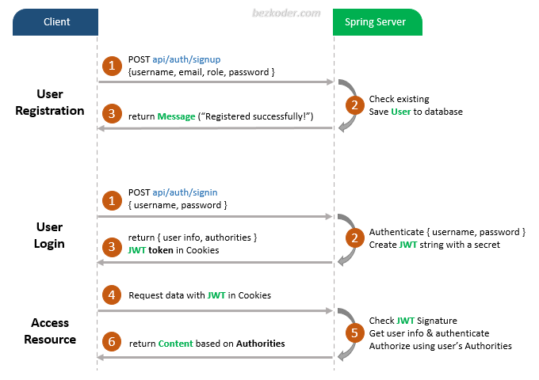

# Test wefin

- Appropriate Flow for User Login and Registration with JWT and HttpOnly Cookie
- Spring Boot Rest Api Architecture with Spring Security
- How to configure Spring Security to work with JWT
- How to define Data Models and association for Authentication and Authorization
- Way to use Spring Data JPA to interact with H2 Database

## User Registration, Login and Authorization process.



## Spring Boot Server Architecture with Spring Security
You can have an overview of our Spring Boot Server with the diagram below:


```
## Run Spring Boot application
```
mvn spring-boot:run
```

## Run following SQL insert statements
```
INSERT INTO roles(name) VALUES('ROLE_USER');
INSERT INTO roles(name) VALUES('ROLE_MODERATOR');
INSERT INTO roles(name) VALUES('ROLE_ADMIN');

# Docker


